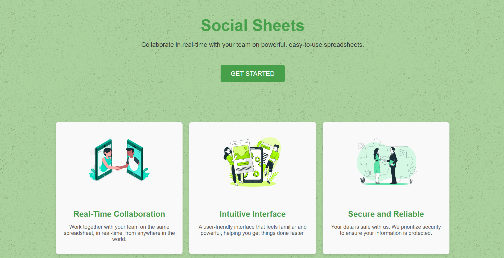
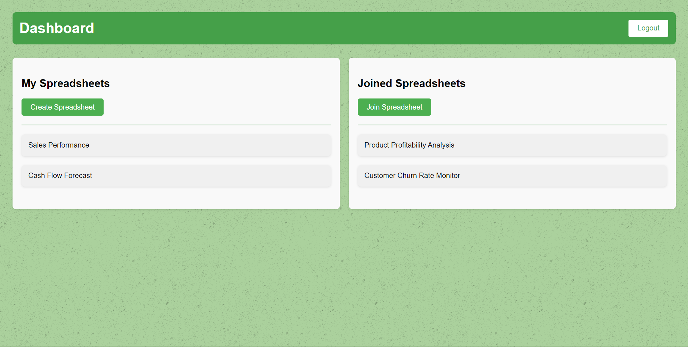
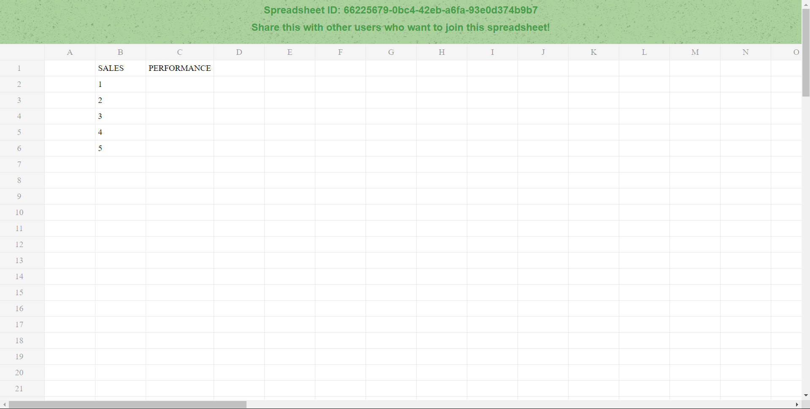

# Social Sheets

Social Sheets, is a collaborative, web-based spreadsheet application designed for teams and individuals who need to work together in real-time. It allows multiple users to interact with the same spreadsheet simultaneously, making it ideal for businesses, project teams, educators, and anyone who needs a shared, powerful, and intuitive tool for data management and analysis. The platform emphasizes ease of use, with a familiar interface, robust security features, and responsive design, making it accessible from any device. Social Sheets is perfect for those who value collaboration, efficiency, and data security in their work.


## Features

- [x] **Core Spreadsheet Functionality** 
- [x] **Real-Time Collaboration** 
- [x] **User Authentication and Access Control** 
- [x] **Data Persistence and Security**
- [x] **Scalable Architecture**
- [x] **Responsive User Interface**
- [x] **Cross-Device Compatibility**


## Deployment

This project, Social Sheets, has been deployed using [Vercel](https://vercel.com/), providing a fast, reliable, and globally distributed platform for hosting web applications. Vercel's seamless integration with GitHub ensures that every update pushed to the repository is automatically deployed, enabling continuous delivery and instant updates for users.

You can access the live version of the project at: [Social Sheets Live](https://social-sheets.vercel.app/)


## Screenshots






## Demo

Insert gif or link to demo


## Tech Stack

This project leverages the following technologies:

- **[ReactJS](https://react.dev/):** Fast,Responsive Rendering and SEO friendly.
- **[Supabase PostgresSQL](https://supabase.com/database):** Database server offering highly scalable and reliable instances.
- **[React-Spreadsheet](https://www.npmjs.com/package/react-spreadsheet):** Performant spreasheet component used to integrate core spreadsheet functionality.


## Environment Variables

To run this project, you will need to add the following environment variables to your .env file

`REACT_APP_SUPABASEURL`

`REACT_APP_SUPABASEKEY`


## Run Locally

Clone the project

```bash
  git clone https://github.com/chaitanya-bhargava/SocialSheets.git
```

Go to the project directory

```bash
  cd SocialSheets
```

Install dependencies

```bash
  npm install
```

Start the server

```bash
  npm run start
```


## Acknowledgements

 - [react-spreadsheet](https://www.npmjs.com/package/react-spreadsheet)
 - [Supabase](https://supabase.com/)
 - [Vercel](https://vercel.com/)

